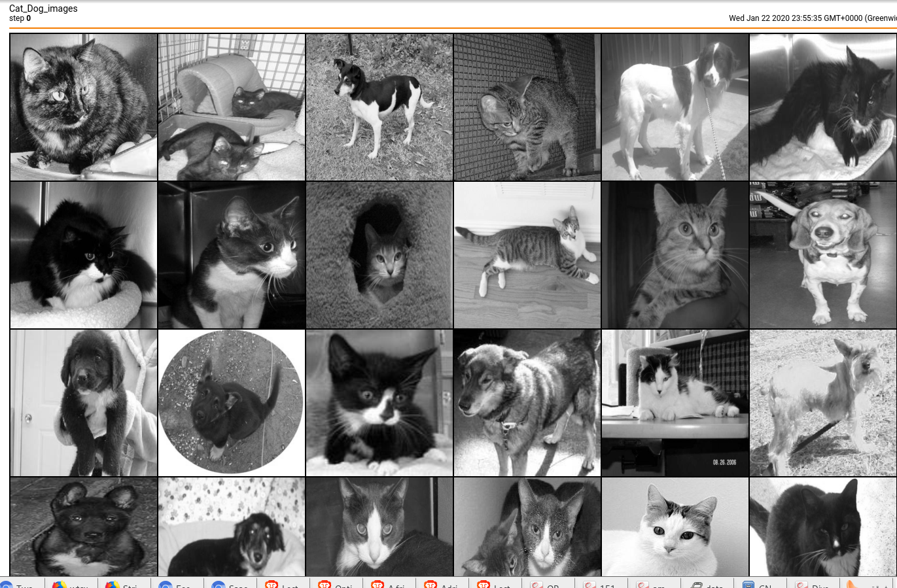
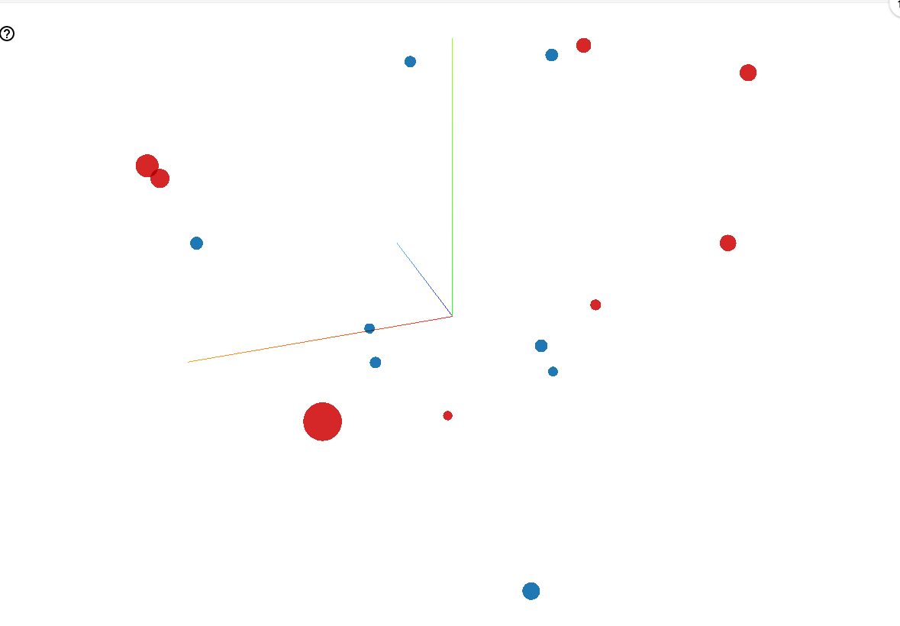

** Instructions **

To run model one type: python main.py model_one  
#which is a model classification of cats and dogs using CNN with 2 convolution layers and 2 fully connected layers. 
To run model two type: python main.py model_two:  
##it is file contains classification of cat and dog using CNN with 4 convolution layers and 2 fully connected layers  

** Using Tensorboard to visualize the output **  
This is the images visulized by tensorboard: 
 
   

the next figure is the Ghraph representation for the CNN model 
 
  

This figure represents the performance of the loss function  
 
  

if we want to represent image projector 
 
  
